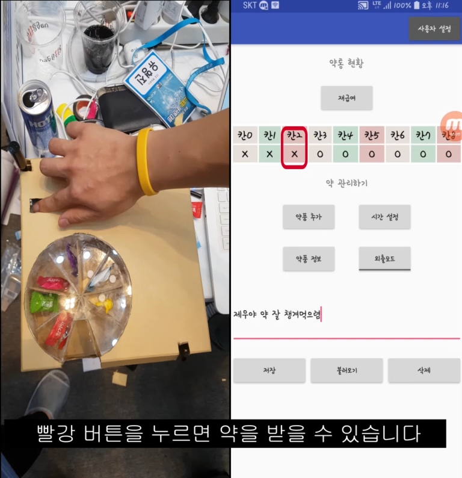

# 약물 오남용을 방지하기 위한 스마트 약통 (2018.08.30~2018.09.01)
* [동영상 링크](https://www.youtube.com/watch?v=kp1p8LfUtRs&t=56s "유튜브")  
* 환자 안전사고 유형 중 약물 오류 때문인 사고가 28%로 높았고, 그 중 환자 오인 때문인 투약 오류가 15% 이상을 차지하고 있는 통계 자료를 보게 되었습니다. 이러한 현상은 약 성분에 대해 잘 알지 못하는실버 계층에 주로 나타나는 것을 알아채고 독거 노인의 약물 오남용을 방지하고 안전사고를 줄이고자 "라즈베리파이 기반 스마트 약통"을 제작하게 되었습니다.  
* 라즈베리파이, Servo 모터, 스테핑 모터, 마이크, 스피커, 토글 버튼 등을 사용하여 음성 및 버튼을 통해 물과 약을 모두 공급할 수 있는 스마트 약통을 제작했습니다. 그리고 약통과 연동되는 Android Application까지 제작하여 현재 남은 약의 양, 주의 사항, 약의 정보, 생활 방식 등을 확인할 수있게 하였고, 정해진 패턴 및 시간에 투약하지 않을 시 보호자에게 알림 문자를 전송하거나 휴대전화 푸쉬 알림이 울리게 했습니다. Google Vision API의 OCR 기술을 이용하고 변형하여 약 봉투 촬영 이미지에서 약 이름만 추출한 뒤, 식약청 의약품 DB에서 해당 약 정보를 크롤링하여 Firebase DB에 저장했습니다. Application에서는 해당 DB에서 데이터를 가져와 텍스트 형태로 화면에 출력하였고, 라즈베리파이에서는 해당텍스트를 Google Text-to-Speech API를 통해 IoT 제품에 취약한 실버 계층에게 약 정보를 읽어주는 기능을 구현했습니다.  
* 약 투여를 위해 스테핑 모터를 사용하여 버튼을 클릭할 때 약통을 40도씩 회전하도록 설정하였습니다. 즉, 총 9일 치의 약을 약통에 담을 수 있습니다. 그리고 물을 공급하기 위해 Servo 모터와 호스를 연결해 사용하였고, 음성인식 및 출력을 하기 위해 마이크와 스피커를 사용했습니다. 또한,웹과 Android Application, 라즈베리파이를 통신할 수 있게 하기 위해 소켓 통신 및 클라우드를 사용하였습니다.  

  
  

### 2019 대한민국 SW 융합 해커톤 '갓오브아이스' 팀

           인하대학교 정보통신공학과 박광석  
           인하대학교 정보통신공학과 권동현  
           인하대학교 정보통신공학과 최제우  
           인하대학교 정보통신공학과 유형진  
           인하대학교 정보통신공학과 전수현  
